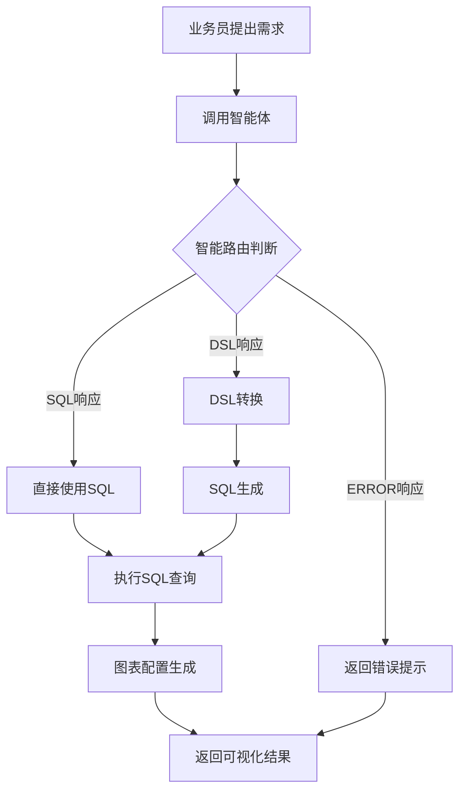

# AI智能助手模块分析报告

## 1. 模块概述

AI智能助手模块是出租车数据分析平台的核心模块之一，提供**自然语言查询转可视化图表**的智能化能力。该模块实现了业务员提出需求后，智能体返回结果，前端根据结果展示符合需求的可视化图表的完整流程。

### 1.1 核心功能

| 功能 | 描述 | 状态 |
|------|------|------|
| 自然语言查询 | 支持业务员用自然语言提出数据分析需求 | ✅ |
| 智能路由 | 根据智能体响应类型自动选择处理流程 | ✅ |
| SQL生成 | 根据DSL或智能体返回生成精准SQL | ✅ |
| 数据查询 | 执行SQL查询MySQL ADS层表 | ✅ |
| 图表可视化 | 自动生成多种图表类型（折线图、柱状图、饼图等）| ✅ |
| 会话管理 | 支持会话的创建、切换、重命名、删除 | ✅ |

### 1.2 业务流程



---

## 2. 架构设计

### 2.1 模块结构

```
modules/ai/
├── client/              # 外部API客户端
│   ├── CozeClient.java    # Coze智能体API客户端
│   └── LLMClient.java     # 通用LLM客户端接口
├── controller/          # REST API控制层
│   └── AiController.java  # AI查询入口控制器
├── dsl/                 # DSL处理模块
│   ├── Dsl.java           # DSL数据模型
│   ├── DslConverter.java  # DSL转换与验证
│   └── DslValidator.java  # DSL校验器
├── service/             # 业务逻辑层
│   ├── AiService.java     # AI服务接口
│   ├── LlmService.java    # LLM服务接口
│   ├── SqlGenerator.java  # SQL生成服务
│   ├── SchemaRetriever.java # 表结构检索服务
│   └── impl/              # 服务实现类
│       ├── AiServiceImpl.java
│       └── LlmServiceImpl.java
├── dto/                 # 数据传输对象
│   ├── AiQueryRequest.java
│   ├── AiQueryResponse.java
│   ├── ChartConfig.java
│   └── LlmResponse.java
└── model/               # 数据模型
    └── ChartData.java     # 图表数据模型
```

### 2.2 核心组件职责

| 组件 | 职责 | 关键方法 |
|------|------|----------|
| **AiController** | REST API入口 | `query()`, `chat()` |
| **AiServiceImpl** | 统一查询入口，智能路由 | `processQuery()`, `handleDslResponse()`, `handleSqlResponse()` |
| **LlmServiceImpl** | 智能体调用与响应解析 | `callAgent()`, `parseResponse()` |
| **CozeClient** | Coze API调用，SSE响应解析 | `callAI()`, `parseSseResponse()` |
| **SqlGenerator** | SQL生成与图表配置建议 | `generateSqlFromDsl()`, `suggestChart()` |
| **DslConverter** | 自然语言到DSL转换 | `validateAndOptimize()` |
| **SchemaRetriever** | 表结构元数据管理 | `getTableSchema()` |

---

## 3. 核心技术实现

### 3.1 智能路由机制

智能路由是AI智能助手模块的核心设计，支持智能体返回的三种响应格式：

```java
// AiServiceImpl.java - 智能路由判断
public AiQueryResponse processQuery(AiQueryRequest request) {
    // 1. 调用智能体获取响应
    LlmResponse llmResponse = llmService.callAgent(request.getQuery(), sessionId);
    
    // 2. 智能路由判断
    if (llmResponse.isErrorResponse()) {
        return handleErrorResponse(request.getQuery(), llmResponse.getErrorMsg());
    } else if (llmResponse.isSqlResponse()) {
        return handleSqlResponse(request.getQuery(), llmResponse, startTime);
    } else {
        return handleDslResponse(request.getQuery(), llmResponse, startTime);
    }
}
```

**响应类型判断优先级**：
1. **ERROR响应**：包含 `parse_failed: true` 字段
2. **SQL响应**：包含 `sql` 字段（优先判断）
3. **DSL响应**：包含 `metric` 或 `dimension` 字段

### 3.2 SSE流式响应解析

Coze API返回SSE格式响应，需要特殊解析：

```java
// CozeClient.java - SSE响应解析流程
private String parseSseResponse(String sseResponse) {
    // 1. 按行分割响应
    String[] lines = sseResponse.split("\n");
    
    // 2. 提取 data: 开头的行
    for (String line : lines) {
        if (line.startsWith("data:")) {
            String dataContent = line.substring(5).trim();
            
            // 3. 解析JSON，提取 content.text 字段
            JsonNode jsonNode = objectMapper.readTree(dataContent);
            if ("content".equals(type) && jsonNode.has("content")) {
                return contentNode.get("text").asText();
            }
        }
    }
}
```

**SSE响应格式示例**：
```
event: message
data: {"type":"content", "content":{"text":"{\"sql\":\"SELECT...\",\"chart_config\":{...}}"}}

event: message
data: {"type":"message_end"}
```

### 3.3 SQL生成机制

SQL生成支持18张ADS层表的动态查询：

```java
// SqlGenerator.java - SQL生成流程
public String generateSqlFromDsl(Dsl dsl) {
    // 1. 根据维度确定目标表
    String tableName = determineTableName(dsl.getDimension(), dsl.getMetric());
    
    // 2. 获取表结构
    TableInfo tableInfo = schemaRetriever.getTableSchema(tableName);
    
    // 3. 解析指标和维度字段
    String metricField = resolveMetricField(tableInfo, dsl.getMetric());
    String dimensionField = resolveDimensionField(tableInfo, dsl.getDimension());
    
    // 4. 构建SQL（包含维度字段选择、GROUP BY、ORDER BY）
    sql.append("SELECT ").append(dimensionField).append(", SUM(").append(metricField).append(") AS value ");
    sql.append("FROM ").append(tableName);
    sql.append("WHERE ").append(buildTimeCondition(dsl.getTimeRange()));
    sql.append("GROUP BY ").append(dimensionField);
    sql.append("ORDER BY ").append(getOrderByClause(dimensionField));
}
```

### 3.4 图表配置生成

根据DSL或SQL自动推荐图表类型：

| 维度类型 | 推荐图表类型 | 说明 |
|----------|-------------|------|
| `stat_date` | 折线图 | 时间序列数据 |
| `hour_of_day` | 折线图 | 时间序列数据 |
| `day_of_week` | 折线图 | 时间序列数据 |
| 其他维度 | 柱状图 | 分类对比数据 |

---

## 4. 前端实现

### 4.1 组件结构

```
src/
├── views/ai/Index.vue          # AI智能助手主页面
├── components/ai/
│   ├── AiQuery.vue              # AI查询组件
│   ├── ChatWindow.vue           # 聊天窗口组件
│   ├── MessageBubble.vue        # 消息气泡组件
│   └── ResultViewer.vue         # 结果展示组件
└── api/ai.ts                    # AI API类型定义与接口
```

### 4.2 图表可视化

前端使用 ECharts 实现响应式图表：

```typescript
// Index.vue - 图表配置
const getChartOption = (msg: any) => {
    const chartType = chartConfig.chartType || 'bar';
    
    if (chartType === 'line') {
        return {
            xAxis: { type: 'category', data: xData, boundaryGap: false },
            yAxis: { type: 'value' },
            series: [{
                type: 'line',
                smooth: true,
                data: yData,
                areaStyle: { color: 'rgba(59, 130, 246, 0.3)' }
            }]
        };
    }
}
```

**响应式尺寸计算**：
- 宽高比：16:10
- 最小高度：300px
- 最大高度：600px

---

## 5. 代码质量评估

### 5.1 优点

| 维度 | 评估 | 说明 |
|------|------|------|
| **架构设计** | 良好 | 模块化设计，职责清晰 |
| **代码规范** | 良好 | 遵循Java命名规范，使用驼峰命名 |
| **异常处理** | 良好 | 完善的异常捕获和日志记录 |
| **可扩展性** | 良好 | 支持多种智能体响应格式 |
| **前后端一致性** | 良好 | 数据结构定义统一 |

### 5.2 待改进项

| 问题 | 严重程度 | 建议 |
|------|----------|------|
| 会话管理使用内存存储 | 中 | 考虑分布式环境下的会话持久化方案 |
| 智能体API密钥硬编码 | 高 | 建议通过配置文件管理敏感信息 |
| 缺少单元测试 | 中 | 建议添加核心逻辑的单元测试 |
| 前端部分变量命名不够规范 | 低 | 统一变量命名风格 |

---

## 6. 修复记录汇总

| 日期 | 修复内容 | 模块 | 状态 |
|------|---------|------|------|
| 2026-05-15 | 代码质量优化与工程化完善 | 全模块 | ✅ |
| 2026-05-14 | Dsl类反序列化修复 | DSL模块 | ✅ |
| 2026-05-14 | 智能体响应解析逻辑修复 | LLM模块 | ✅ |
| 2026-05-14 | Coze API SSE响应解析修复 | 客户端模块 | ✅ |
| 2026-05-14 | API路径配置修复 | 控制器模块 | ✅ |
| 2026-05-13 | SQL生成与图表可视化修复 | SQL生成模块 | ✅ |

---

## 7. 接口文档

### 7.1 统一查询接口

**POST** `/api/ai/query`

请求体：
```json
{
    "query": "近7天订单趋势",
    "sessionId": "session_xxx",
    "database": "default"
}
```

响应体：
```json
{
    "code": 200,
    "message": "success",
    "data": {
        "query": "近7天订单趋势",
        "sql": "SELECT stat_date, SUM(total_trips) AS value FROM analysis_kpi_daily WHERE ...",
        "data": [...],
        "chartConfig": {
            "chartType": "line",
            "xAxisField": "stat_date",
            "yAxisField": "value",
            "title": "订单总量 - 日期 (最近7天)",
            "data": [{"name": "2025-01-01", "value": 1200}]
        },
        "executionTime": 150,
        "count": 7,
        "hasChart": true
    }
}
```

### 7.2 兼容旧版接口

**POST** `/api/ai/chat`

与 `/api/ai/query` 功能完全一致，保持向后兼容。

---

## 8. 技术栈

| 分类 | 技术 | 版本 |
|------|------|------|
| 后端框架 | Spring Boot | 3.2.x |
| 数据库 | MySQL | 8.0+ |
| 智能体平台 | Coze | - |
| JSON处理 | Jackson | 2.15+ |
| API文档 | Swagger/OpenAPI | 3.0 |
| 前端框架 | Vue.js | 3.4+ |
| 图表库 | ECharts | 5.4+ |
| 构建工具 | Maven / npm | - |

---

## 9. 改进建议

### 9.1 短期改进

1. **敏感信息管理**：将Coze API密钥移至配置文件或密钥管理服务
2. **单元测试覆盖**：为核心服务类添加单元测试
3. **代码注释完善**：补充复杂逻辑的注释说明

### 9.2 中期改进

1. **会话持久化**：引入Redis或数据库存储会话记录
2. **缓存机制**：对频繁查询的结果进行缓存
3. **异步处理**：支持长时查询的异步处理和进度反馈

### 9.3 长期规划

1. **多智能体支持**：支持切换不同的LLM提供商
2. **查询优化建议**：基于历史查询提供优化建议
3. **权限控制**：添加细粒度的访问控制

---

## 10. 总结

AI智能助手模块已完成核心功能开发，实现了从自然语言查询到可视化图表的完整流程。模块具备以下特点：

- ✅ **智能路由**：支持DSL、SQL、ERROR三种响应格式的自动识别和处理
- ✅ **工程化规范**：代码结构清晰，命名规范，异常处理完善
- ✅ **响应式设计**：图表尺寸根据容器宽度动态调整
- ✅ **前后端兼容**：支持新旧两种API接口，数据结构一致

项目编译验证通过，可正常运行使用。

---

**生成日期**：2026-05-14  
**文档版本**：v1.0  
**适用项目**：出租车数据分析平台